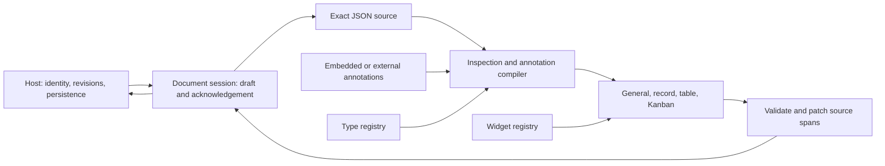

# Contributing

Contributions are welcome.

1. Install Node.js 22.13+ (22 series) or 24+ and run `npm ci`.
2. Add tests alongside behavior changes.
3. Run `npm test`, `npm run check`, and `npm run build`. For exports, dependencies, CSS, or CLI changes also run `npm run test:packages`.
4. `npm run check:architecture` enforces package boundaries, runtime dependency declarations, host API isolation, and acyclic production imports.
5. Keep host-specific APIs outside `packages/core` and `packages/react`.

New types belong in the type registry. New editors belong in the widget registry; do not add type-specific branches to the shared viewer unless the display behavior itself is universal.

Start with the [architecture](#architecture) notes below, the [annotation specification](packages/core/README.md#annotation-specification), and [React integration](packages/react/README.md#react-integration). A descriptor extension should document its JSON representation, validation, editor conversion, sort/filter semantics, and a small working fixture.

Use `.js` extensions for relative TypeScript imports so emitted ESM works in Node. Test consumer-facing imports through the package exports, without source aliases or `skipLibCheck`. Keep regression tests near the responsible layer: pure paths/validation/patches in core, interactions in React, document switching in web, and real temporary files for CLI persistence.

The source string is authoritative. Never rebuild an imported document from `JSON.parse` output for an unrelated edit. Validate untrusted annotations before rendering, use own-property traversal, preserve unsaved drafts on failure, and capture document identity before asynchronous work. No native regular expressions compiled from annotation input.

The React stylesheet is compiled and scoped by `scripts/scope-styles.mjs`. Add semantic tokens through `--json-views-*`, keep selectors within the viewer surface, and use its portal destination. Verify a light and dark viewer beside unrelated host controls in `examples/consumer`.

For changes to annotation version 1, update both the normative specification and packaged schema, then add a shared conformance fixture. A schema field being structurally valid does not mean its path, registered type, or value is valid for a particular document.

## Architecture

JSON Views treats source text, annotations, and presentation as separate contracts. Hosts supply identity and persistence; the viewer never discovers files or selects a network destination.

### Package boundaries

| Layer | Responsibility | Does not own |
| --- | --- | --- |
| `packages/core` | Path matching, annotation compilation, validation, inference, projection, source patches, document sessions | React, DOM, network, filesystem |
| `packages/react` | Navigation, views, typed editors, diagnostics, scoped themes and portals | Product auth, routing, storage |
| `apps/web` | Upload/download, explicit source actions, browser document lifetime, CLI transport | Annotation semantics |
| `packages/cli` | One-file capability, HTTP protocol, revision checks, filesystem writes | Editor state, type semantics |

Within React, `json-content.tsx` owns document orchestration and `structured-data/use-metadata-persistence.ts` separates controlled, session, and embedded annotation storage from file conversion. `json-view.tsx` owns navigation, `view-model.ts` projects display data, and the record/table/Kanban modules render their own layouts. `row-mutations.ts` constructs row changes using core path helpers. Registries provide type-specific behavior across every view.

### Source and save invariants

1. Original source text is authoritative. Inspection values may lose numeric precision; source diagnostics identify these values. Unrelated patches preserve bytes, and replacement of a risky subtree requires source editing.
2. One `JsonDocumentSession` represents one immutable document identity. Hosts include account/workspace identity where file names are not globally unique. React remounts local navigation and widget drafts when `documentId` changes.
3. A save receives its captured identity, acknowledged base source, and optional base revision. Hosts enforce compare-and-swap in their storage layer and return the exact accepted source/revision.
4. The save promise represents actual persistence. Failures preserve the draft and expose retry/reload controls. A save acknowledgement cannot erase text typed after submission.
5. External changes while a draft is dirty create a conflict. The user can recover their draft before discarding it. Legacy callbacks without revisions work, but intentional rollback and delayed echoes cannot always be distinguished; revision-aware hosts are preferred.

`JsonDocumentSession` is framework independent and can back a source editor or CLI client. React's `useOptimisticTextDocument` adapts it with `useSyncExternalStore`. Hosts may use the same controller to coordinate source mode and visual mode. CLI requests are serialized per real file path within one process; filesystem revision checks cannot provide a cross-process transaction against an uncooperative writer.

### Annotation and extension contract

The [versioned specification](annotation-spec.md) and its conformance fixtures define precedence, paths, validation, dates, filtering, and source fidelity. Compilation yields diagnostics instead of trusting annotation shapes. Future annotation versions remain available but cannot be rewritten through version 1 settings. RE2JS handles untrusted patterns; plugin code is trusted host code.

The core registry owns descriptor validation, JSON-value validation, conversion between JSON and editor models, filtering, and sorting. The React registry owns display/editor components and optional quick edits. Registries notify subscribers when changed. Public types and examples live in the package exports; adding a widget must not require editing shared renderer switches.

### Host integration and resource limits

`JSONContent` wraps itself in `JsonViewsSurface`. Its compiled stylesheet scopes selectors and private CSS variables, including Tailwind defaults. Per-instance portal roots inherit the instance theme and public semantic tokens. `standalone.css` is an opt-in style for the standalone host, not required by an embedded viewer.

Tables virtualize DOM rows; parsing, validation, inference, projection, and Kanban remain synchronous. There is no claim of unlimited document size. Measure representative product files and choose a host budget or move pure core work to a worker for very large inputs. Batch replacement scans once; it rejects overlapping edits instead of silently applying ambiguous plans.

### Enforced boundaries

`npm run check:architecture` inspects production imports, verifies declared runtime/peer dependencies and public package exports, rejects runtime import cycles, and prevents filesystem/network/storage APIs from entering reusable layers. It runs in `npm run check` and the release gate. Core and React also reject unused declarations and parameters during type checking.

Table rendering, column controls, table contracts, and reusable value cells live in separate modules. `viewer-state.tsx` owns bounded per-surface caches; provider defaults are instance-owned as well. The web host keeps source formatting, document construction and annotation embedding in `document-model.ts`.

Batch removals and property upserts resolve original paths in a single source scan. Renderers must not reorder array deletions themselves or repeatedly parse an entire document for each new column cell. CSV validates non-negative row indices before resolving them, so its header cannot be addressed as a data row. Format capability checks use the same lossless serializer as actual JSON writes.

## Releasing

The repository prepares three public packages at a coordinated version: `@script-it/json-views-core`, `@script-it/json-views-react`, and `@script-it/json-views`. The `apps/web` workspace is not published to npm. Nothing in the build or test commands publishes a package.

### Release candidate

1. Review public API and annotation changes. Document behavior changes and keep version 1 metadata compatible, or introduce a separately specified version. Update all package versions and internal dependency versions together, then refresh the lockfile.
2. Run `npm ci` and `npm run check:release` on a clean checkout with a supported Node version. Repeat the installed consumer with `JSON_VIEWS_CONSUMER_REACT_MAJOR=18 npm run test:packages`. CI covers Node 22 and 24 with both React majors.
3. Review browser interactions in the standalone editor and independent consumer: scalar/date/custom-object edits, filters, keyboard navigation, both themes, portal colors, malformed source and annotations, rejected saves, and switching files with a pending save.
4. Inspect `npm pack --dry-run --workspace <package-name>` for each public package. Build artifacts, README, MIT license, and generated third-party notices must be present. Core also includes `schema.json`; React includes scoped and standalone styles; CLI includes the built web assets and serves their notices. `prepack` rebuilds from source, while CI packs with `--ignore-scripts` only after a successful full build. Notice generation reads the installed production dependency graph and fails when a dependency has no license file; review any version-specific upstream fallback in `licenses/` when updating dependencies.
5. Record the supported runtimes, any measured file-size limits, and the remaining cross-process filesystem race in release notes. The packages are ESM; no CommonJS export is promised.

### Publication

Maintainers must first confirm npm scope access and the repository's GitHub Pages settings. Publish the coordinated versions core before React before CLI, with public access. React pins core at an exact version, so the order is load-bearing. Each package publishes to the default `latest` tag; pass `npm publish --tag <name>` deliberately when a release should not become the default, and confirm the result with `npm dist-tag ls`, because `npx @script-it/json-views` resolves `latest`. Verify the registry-installed example and the CLI before announcing availability. Publishing and changing distribution tags are deliberate maintainer actions; CI does not hold a publishing token.

The Pages workflow deploys `apps/web/dist` on `main`. Its imports resolve built packages, so it cannot hide missing package exports behind development aliases. A passing local run does not prove that GitHub environment permissions or npm ownership are configured; check the actual release run before announcing availability.
